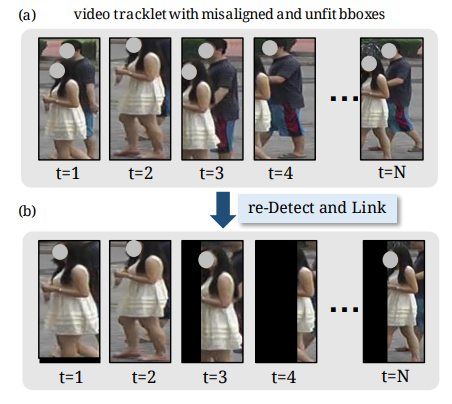

# Video-based Person Re-identification without Bells and Whistles

[[Paper]](https://openaccess.thecvf.com/content/CVPR2021W/AMFG/papers/Liu_Video-Based_Person_Re-Identification_Without_Bells_and_Whistles_CVPRW_2021_paper.pdf) [[arXiv]](https://arxiv.org/pdf/2105.10678.pdf)

[Chih-Ting Liu](https://jackie840129.github.io/), [Jun-Cheng Chen](https://www.citi.sinica.edu.tw/pages/pullpull/contact_en.html), [Chu-Song Chen](https://imp.iis.sinica.edu.tw/) and [Shao-Yi Chien](http://www.ee.ntu.edu.tw/profile?id=101),<br/>Analysis & Modeling of Faces & Gestures Workshop jointly with IEEE Conference on Computer Vision and Pattern Recognition (**CVPRw**), 2021

This is the pytorch implementatin of Coarse-to-Fine Axial Attention Network **(CF-AAN)** for video-based person Re-ID. 
<br/>It achieves **91.3%** in rank-1 accuracy and **86.5%** in mAP on our aligned MARS dataset.

## News

**`2021-06-13`**: 
- We release the code and aligned dataset for our work.
- We update the Readme related to our new dataset, and the others will be updated gradually.

## Aligned dataset with our re-Detect and Link module

### Download Link : 

- MARS (DL) : [[Google Drive]](https://drive.google.com/file/d/1adP39y7xoKYX8Z4lyBtZiDTg9kZyK1Cx/view?usp=sharing)
- DukeMTMC-VideoReID (DL) : [[Google Drive]](https://drive.google.com/file/d/1JjYc1lMe3IpMlAf3otk_68H-YX84njMd/view?usp=sharing)

### Results
The video tracklet will be re-Detected, linked (tracking) and padded to the original image size, as follow.
<p align="left"></p>

### Folder Structure
MARS dataset:
```
MARS-DL/
|-- bbox_train/
|-- bbox_test/
|-- info/
|-- |-- mask_info.csv (for DL mask)
|-- |-- mask_info_test.csv  (for DL mask)
|-- |-- clean_tracks_test_info.mat (for new evaluation protocol)
|-- |-- .... (other original info files)
```
DukeV dataset:
```
DukeMTMC-VideoReID-DL/
|-- train/
|-- gallery/
|-- query/
|-- duke_mask_info.csv (for DL mask)
|-- duke_mask_info_gallery.csv  (for DL mask)
|-- duke_mask_info_query.csv  (for DL mask)
```
You can put this two folders under your root dataset directory.
```
path to your root dir/
|-- MARS-DL/
|-- DukeMTMC-VideoReID-DL/
```
## Coarse-to-Fine Axial Attention Network (CF-AAN)

comming soon

## New Evaluatoin Protocol

comming soon

## Citation
```
@InProceedings{Liu_2021_CVPR,
    author    = {Liu, Chih-Ting and Chen, Jun-Cheng and Chen, Chu-Song and Chien, Shao-Yi},
    title     = {Video-Based Person Re-Identification Without Bells and Whistles},
    booktitle = {Proceedings of the IEEE/CVF Conference on Computer Vision and Pattern Recognition (CVPR) Workshops},
    month     = {June},
    year      = {2021},
    pages     = {1491-1500}
}
```
## Reference

The structure of our code are based on [reid-strong-baseline](https://github.com/michuanhaohao/reid-strong-baseline).  
Some codes of our CF-AAN are based on [axial-deeplab](https://github.com/csrhddlam/axial-deeplab)

## Contact

[Chih-Ting Liu](https://jackie840129.github.io/), [Media IC & System Lab](https://github.com/mediaic), National Taiwan University

E-mail : jackieliu@media.ee.ntu.edu.tw
