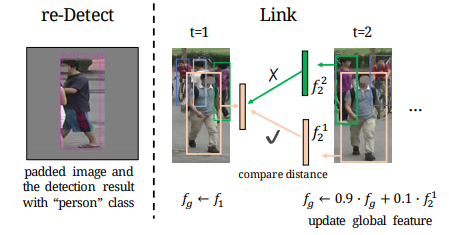

# Video-based Person Re-identification without Bells and Whistles

[[Paper]](https://openaccess.thecvf.com/content/CVPR2021W/AMFG/papers/Liu_Video-Based_Person_Re-Identification_Without_Bells_and_Whistles_CVPRW_2021_paper.pdf) [[arXiv]](https://arxiv.org/pdf/2105.10678.pdf)

[Chih-Ting Liu](https://jackie840129.github.io/), [Jun-Cheng Chen](https://www.citi.sinica.edu.tw/pages/pullpull/contact_en.html), [Chu-Song Chen](https://imp.iis.sinica.edu.tw/) and [Shao-Yi Chien](http://www.ee.ntu.edu.tw/profile?id=101), Analysis & Modeling of Faces & Gestures Workshop jointly with IEEE Conference on Computer Vision and Pattern Recognition (**CVPRw**), 2021

This is the pytorch implementatin of Coarse-to-Fine Axial Attention Network **(CF-AAN)** for video-based person Re-ID. 
 It achieves **91.3%** in rank-1 accuracy and **86.5%** in mAP on our aligned MARS dataset.

# Aligned dataset with our re-Detect and Link module

 

